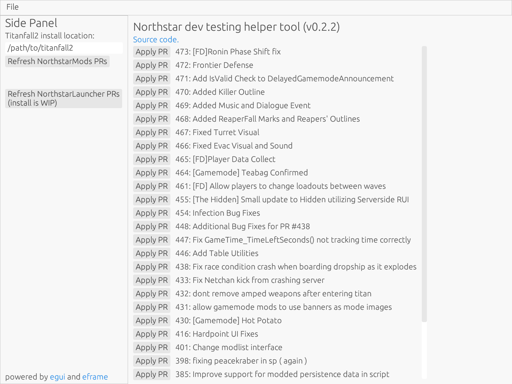

# northstar_dev_testing_helper_tool

> :warning: **DEPRECATED** :warning:
>
> This tools has been deprecated in favour of importing the functionality to [FlightCore](https://github.com/R2NorthstarTools/FlightCore). For info on how to use FlightCore to install pull requests, check [this README](https://github.com/R2NorthstarTools/FlightCore/blob/ca65fb29fc2895e1912d931b4f486388fabaf7bd/docs/DEV-TOOLS.md#northstar)

A small tool to ease in testing PRs for [Northstar](https://github.com/R2Northstar/).

Allows for 1-click download of a PR to Titanfall2 install folder as a separate profile. Also places a batch file into your Titanfall2 folder called `r2ns-launch-mod-pr-version.bat` which launches Northstar with the PR profile.

> **Note:** This tool is aimed at developers and expects a working Northstar install. Further it gives no guarantees to maintaining your Northstar install. Do not complain if your Northstar install breaks and requires reinstalling Northstar!
>
> If you just want a tool to auto-install and update Northstar, use [FlightCore](https://github.com/R2NorthstarTools/FlightCore/) instead.

## Usage

Simply download the latest release for your platform (Windows or Linux) from [the releases page](https://github.com/GeckoEidechse/northstar_dev_testing_helper_tool/releases), unzip it, and run.

Set your Titanfall2 install path (should be saved between restarts), get the list of current pull requests for NorthstarLauncher or NorthstarMods, and then click "Apply PR" on the appropriate PR.

## Building and development

Like any Rust project use [cargo](https://doc.rust-lang.org/cargo/) to build and run the code, e.g. `cargo run`.

If you want to fork the code for your own project, note that it uses the [`self_update` crate](https://crates.io/crates/self_update) for updates. The source for updates is hardcoded to this repository and would need to be changed to your own in `main.rs`.
