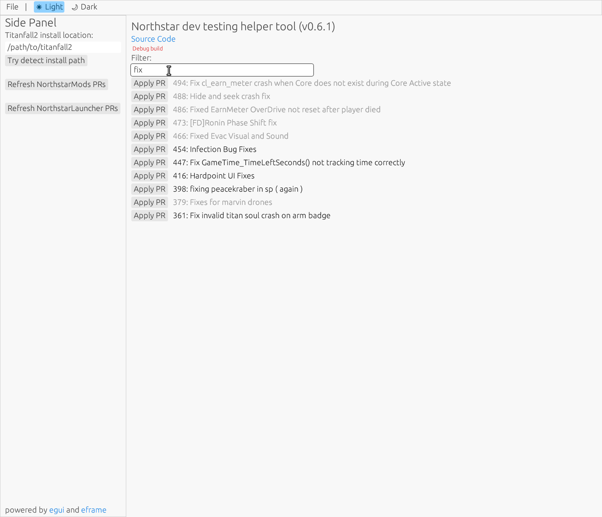

# northstar_dev_testing_helper_tool

A small tool to ease in testing PRs for [Northstar](https://github.com/R2Northstar/).

Allows for 1-click download of a PR to Titanfall2 install folder.

> **Note:** This tool is aimed at developers and expects a working Northstar install. Further it gives no guarantees to maintaining your Northstar install. Do not complain if your Northstar install breaks and requires reinstalling Northstar!
>
> If you just want a tool to auto-install and update Northstar, use [Viper](https://github.com/0neGal/viper) instead.

